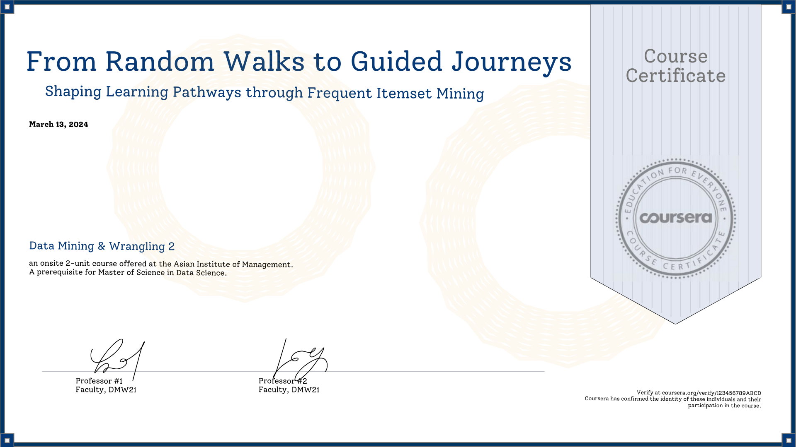

<h1>
  
</h1>

<h1>Authors</h1>
Paula Martinez, Christian Plan, Nico Ting

<h1>Project Description</h1>
This project developed a data-driven approach to create personalized learning pathways for online education platforms. By analyzing patterns in user preferences from a Coursera reviews dataset, the team applied frequent itemset mining and association rule mining algorithms. These techniques clustered courses into technical and non-technical categories, identified commonly co-enrolled courses, and generated tailored course recommendations. The personalized recommendations outperformed random suggestions in A/B testing, providing a better match for learners' interests and goals. For new users without prior data, the system suggests starter course bundles across beginner and intermediate levels.

<h1>Key Takeaways</h1>
<ol>
  <li>The Association Rule Recommendation approach outperforms random recommendations by leveraging frequent itemsets and association rules to provide more relevant and personalized course suggestions.</li>
  <li>The effectiveness of the Association Rule Recommendation method relies on having a sufficient number of frequent antecedents and consequents in the data that meet the minimum confidence threshold. For users with less common course histories, recommendations can be generated directly from the frequent itemset mining (FIM) results.</li>
  <li>To address the cold start problem for new users with no prior data, the proposed solution is to recommend beginner and intermediate-level course bundles or pathways identified through FIM, separately for technical and non-technical courses. This approach provides a structured learning foundation tailored to new users' potential needs and experience levels.</li>
</ol>
